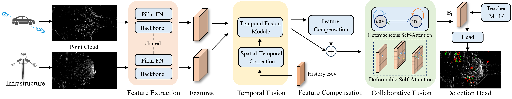

# V2X-DGPE


**V2X-DGPE: Addressing Domain Gaps and Pose Errors for Robust Collaborative 3D Object Detection**.

<!-- ---

## Paper  
[Link to the paper](#)

--- -->

## Installation  
You can follow the **CoAlign** installation steps provided in the Feishu documents:

- **Chinese version**: [Link](https://udtkdfu8mk.feishu.cn/docx/LlMpdu3pNoCS94xxhjMcOWIynie)
- **English version**: [Link](https://udtkdfu8mk.feishu.cn/docx/SZNVd0S7UoD6mVxUM6Wc8If6ncc)

Alternatively, refer to the [OpenCOOD data introduction](https://opencood.readthedocs.io/en/latest/md_files/data_intro.html) and [OpenCOOD installation guide](https://opencood.readthedocs.io/en/latest/md_files/installation.html) for data preparation and installation steps for CoAlign. The installation process is the same as OpenCOOD, with the exception of some additional dependencies required by CoAlign.

---

## Dataset Preparation  

### DAIR-V2X  
1. Prepare the **DAIR-V2X-C** dataset following the [official guide](https://github.com/AIR-THU/DAIR-V2X) and then prepare the complemented annotations.  
2. Then process the data:  
    ```bash
    cd ~/V2X-DGPE
    python opencood/data_utils/datasets/basedataset/dairv2x_basedataset.py
    ```
3. The folder structure should look like this:
    ```
    cooperative-vehicle-infrastructure/
    ├── cooperative/
    ├── gt_database_fusion/
    ├── infrastructure-side/
    ├── vehilce-side/
    ├── dairv2x_dbinfos_fusion.pkl
    ├── train.json
    └── val.json
    ```
---

## Training  

### Train the Teacher Model  
```bash
bash opencood/tools/scripts/dist_train.sh 4 opencood/hypes_yaml/dairv2x/lidar_only/pointpillar_early_gtsample_multiscale.yaml early
```

### Train the Student Model
```bash
bash opencood/tools/scripts/train_w_kd.sh opencood/hypes_yaml/dairv2x/lidar_only/pointpillar_pdd_distillation.yaml opencood/logs/v2x_dgpe_student intermediate
```
### Train the Student Model(Noise)
```bash
bash opencood/tools/scripts/train_w_kd.sh opencood/hypes_yaml/dairv2x/lidar_only/pointpillar_pdd_distillation.yaml opencood/logs/v2x_dgpe_student_noise intermediate
```

## Testing

Run the following command to test the student model:
```bash
python opencood/tools/inference.py --model_dir opencood/logs/v2x_dgpe_student --fusion_method intermediate
python opencood/tools/inference_w_noise.py --model_dir opencood/logs/v2x_dgpe_student_noise --fusion_method intermediate
```

## Checkpoints

The V2X-DGPE teacher , student, student-noise, v2x-dgpe/opencood/logs/lcfm240602(for history input) models, can be found in `opencood/logs`.

## Acknowledgements

Thanks to [V2X-VIT](https://github.com/DerrickXuNu/v2x-vit) and [DI-V2X](https://github.com/Serenos/DI-V2X?tab=readme-ov-file) for their contributions.
The code is built on [CoAlign](https://github.com/yifanlu0227/CoAlign).
